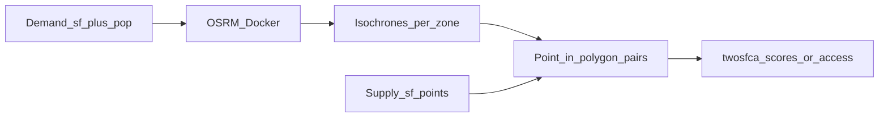

# twosfcaosrm

**twosfcaosrm** is a small R package that connects a standard **two-step floating catchment area (2SFCA)** workflow to a **local Open Source Routing Machine (OSRM)** service. It wraps common patterns—batch isochrones, pairwise travel times/distances via the **table** API, point-in-polygon assignment of suppliers to demand catchments, and the competition ratio algebra—so you do not have to reassemble everything from scattered scripts.

> **Name check:** routing is done with the CRAN package [**osrm**](https://CRAN.R-project.org/package=osrm) talking to **OSRM**. There is no “orsmr” package; that wording is a frequent typo.

## What you bring

This package does **not** ship sample polygons or facility points (no redistributable PHI in a methods repo). You supply:

| Input | Role |
|--------|------|
| Demand zones | `sf` polygons or points with an id (e.g. tract `GEOID`) and **population** (or other demand weight). |
| Demand coordinates | Longitude/latitude (or `sf` points) for **OSRM** isochrone centers—often population-weighted centroids. |
| Supply sites | `sf` points for providers and a unique key (`query` / `name` / etc.). |
| Running OSRM | Docker (or native) OSRM with profiles you need (e.g. `car` on port 5001, `foot` on 5002). |

## Pipeline overview



1. **Start OSRM** (see below) for each profile you need.
2. **Isochrones / isodistances:** `osrm_isochrones_batch()`, `isochrones_func()`, or `osrm_isodistance_batch()` call `osrm::osrmIsochrone()` / `osrm::osrmIsodistance()` against `http://127.0.0.1:PORT/`.
3. **Assign suppliers:** project to a local CRS (e.g. `3857` or a state plane like `2263`), then `sf::st_within()` or `match_supplies_to_isochrones()`.
4. **Scores:** either build `pairs` yourself and call `twosfca_scores()`, or call `access()` to join results back onto demand polygons in one step.

### 2SFCA logic

For demand zones *i* (population *P~i~*) and supplies *j* (capacity *S~j~*), each pair must appear in `pairs` if zone *i*’s catchment contains site *j*.

- **Step 1:** *R~j~* = *S~j~* / Σ *P~i~* over all demand zones *i* whose catchment contains *j*.
- **Step 2:** *A~i~* = Σ *R~j~* over supplies *j* inside *i*’s catchment.

With identical time thresholds and symmetric interpretation, this matches demand-centered isochrones around tract centroids.

## Docker / OSRM runbook (short)

1. Install **Docker** and ensure it is running.
2. Download an `.osm.pbf` extract that covers your study area ([Geofabrik](http://download.geofabrik.de/) or equivalent).
3. Pre-process the graph with the OSRM toolchain (`osrm-extract`, `osrm-partition`, `osrm-customize`) *or* follow the official **project-osrm/osrm-backend** Docker workflow for your extract.
4. Run one **routing** container per built profile (or expose multiple profiles if your image supports it). Map host ports—e.g. `5001` for `car`, `5002` for `foot`—to the container’s `5000`.
5. Health check from the host, e.g.  
   `curl "http://127.0.0.1:5001/route/v1/driving/-74.0,40.7;-73.9,40.8?overview=false"`
6. In R, pass the same base URL into this package (including trailing slash):  
   `osrm_base_url = "http://127.0.0.1:5001/"`.

Official references: [OSRM](http://project-osrm.org/), [osrm-backend Docker](https://github.com/Project-OSRM/osrm-backend/blob/master/docker/README.md).

**Resource hints:** full regional extracts plus OSRM preprocessing need substantial **disk** and **RAM**; route requests are much lighter than building the graph.

## Function highlights

| Function | Purpose |
|----------|---------|
| `osrm_isochrones_batch()` | Loop / safe batch isochrones for many origins. |
| `osrm_isodistance_batch()` | Network-distance shells (meters). |
| `isochrones_func()` | Manuscript-style wrapper: one time ring, `sf` polygons. |
| `duration_url()` | Pairwise **travel time** via `osrm::osrmTable()` (diagonal). |
| `distance_url()` | Pairwise **network distance** via `osrmTable()`. |
| `match_supplies_to_isochrones()` | Long `supply_id` / `demand_id` pairs from `st_within`. |
| `iso_nearest_data_prep()` | Expand `st_within` list columns and add zone centroids for OD tables. |
| `twosfca_scores()` | Step 1 + Step 2 from `pairs` + demand/supply tables. |
| `access()` | One-shot: match + 2SFCA + join scores to demand `sf`. |
| `gpt_access()` | Alias of `access()` for older scripts. |

## Install (development)

From the repository root (on macOS, setting `COPYFILE_DISABLE=1` avoids AppleDouble
`._*` files on some external volumes when building):

```r
# install.packages("remotes")
Sys.setenv(COPYFILE_DISABLE = "1") # optional on macOS
remotes::install_local("twosfcaosrm", dependencies = TRUE)
```

Or from a shell:

```sh
export COPYFILE_DISABLE=1
R CMD build twosfcaosrm
R CMD INSTALL twosfcaosrm_*.tar.gz
```

## Pseudocode (bring your own `sf`)

```r
library(sf)
library(twosfcaosrm)

# demand_sf: polygons with GEOID, population
# demand_xy: data.frame with GEOID, longitude, latitude (centroids)
# pharm_sf: SUPPLY points with column `query`

iso_car <- isochrones_func(
  demand_xy, "latitude", "longitude", minutes = 10,
  osrm_base_url = "http://127.0.0.1:5001/", profile = "car"
)

# merge population onto iso layer by GEOID — your join keys may differ
iso_with_pop <- dplyr::left_join(iso_car, sf::st_drop_geometry(demand_sf), by = "GEOID")

out <- access(
  pnts = pharm_sf,
  isochrones = iso_with_pop,
  supply = sf::st_drop_geometry(pharm_sf),
  name_col = "access_10",
  demand_id_col = "GEOID",
  supply_id_col = "query",
  pop_col = "population",
  crs_for_match = 3857
)
```

## Operations notes

- **Failed isochrones:** OSRM sometimes returns invalid or empty polygons (e.g. disconnected roads, snap failures). Use `keep_failures` or try/catch patterns; drop or impute zones consistently.
- **Boundary effects:** extend demand polygons or isochrone coverage if suppliers just outside admin borders should compete (as in multi-county NYC-adjacent workflows).
- **Chunking:** very large `duration_url()` tables can hit OSRM coordinate limits; split `data` into chunks and `bind_rows()`.

## Extensions not in this package

Uncertainty propagation (e.g. ACS margins of error), mode-choice weighting, and custom `lwc_*` simulation helpers from individual projects are intentionally out of scope here; keep those in your analysis QMD or a separate package that lists this package under `Suggests:`.

## License

MIT © package authors; see `LICENSE` and `DESCRIPTION`.
